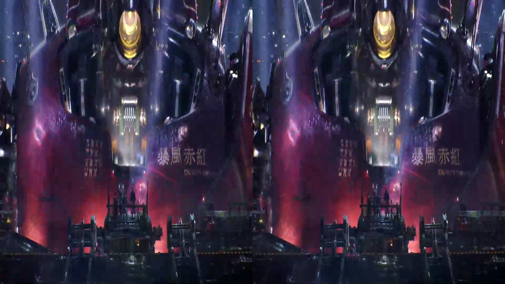

# 3D Movie Data Processing Guide

## 1. Prepare 3D Data
The code provided here is based on SBS (Side-by-Side) movie data, as shown in the figure below:



Then remove the beginning and ending portions of each movie, as these sections contain many meaningless segments (opening credits, production logos, etc.). This can be done using video editing software. Alternatively, in step 4 below, after obtaining the clips, you can identify the anchor clips at the beginning and end according to the timeline, and remove the segments before and after them.

## 2. Convert Movie Files to 16 FPS

### (1) Collect Video Paths
Traverse all 3D movie data folders obtained from step 1 to generate a text file containing the absolute paths of all raw 3D movies:

```bash
python collect_video_paths.py "path/to/3Dmovie/folder" --output raw_3DMovie.txt
```

### (2) Adjust Movie FPS
Convert the movie data to 16 FPS:

```bash
python convert_fps_to_16.py raw_3DMovie.txt -o 3DMovie_fps16 -t 8
```

**Parameters:**
- `raw_3DMovie.txt`: Input file containing paths to raw 3D movies
- `-o 3DMovie_fps16`: Output folder for converted videos
- `-t 8`: Number of threads to use for processing

## 3. Split Movies into Scenes Clips Using PySceneDetect

### (1) Collect FPS16 Video Paths
Gather the paths of all 16 FPS videos:

```bash
python collect_video_paths.py ./3DMovie_fps16 --output 3DMovie_fps16.txt
```

### (2) Split Each Movie into Scenes Clips
Divide each movie into segments based on scene detection:

```bash
python SceneSplit.py 3DMovie_fps16.txt ./3DMovie_fps16_SplitScene --workers 6
```

**Parameters:**
- `video_list.txt`: Input file containing paths to 16 FPS videos
- `./3DMovie_fps16_SplitScene`: Output folder for split scene videos
- `--workers 6`: Number of parallel workers for processing

## 4. Extract Scene Clips with 81+ Frames and Split into 81-Frame Segments

### (1) Collect Scene Video Paths
Gather the paths of all scene video clips from step 3:

```bash
python collect_video_paths.py ./3DMovie_fps16_SplitScene --output 3DMovie_fps16_Splitscene.txt
```

### (2) Filter Out Short Scenes
Remove scene clips with fewer than 81 frames:

```bash
python FilterVideosByFrameCount.py -o 3DMovie_fps16_Splitscene_filtered_81frames.txt --min-frames 81
```

### (3) Split Long Scenes into 81-Frame Segments
Cut scene videos with more than 81 frames into segments of 81 frames each:

```bash
python SplitSceneVideo.py 3DMovie_fps16_Splitscene_filtered_81frames.txt -f 81 -w 16 -o ./3DMovie_fps16_SplitScene_81frameSegments
```

**Parameters:**
- `3DMovie_fps16_Splitscene_filtered_81frames.txt`: Input file containing filtered scene video paths
- `-f 81`: Number of frames per segment
- `-w 16`: Number of parallel workers for processing
- `-o ./3DMovie_fps16_SplitScene_81frameSegments`: Output folder for 81-frame segments

## 5. Reduce Redundancy by Sampling Odd-Indexed Segments

To avoid redundancy, keep only the odd-indexed segments (1st, 3rd, 5th, etc.) from each scene clip, ultimately retaining half of the segments from each scene clip.

### (1) Collect All Segments
Gather the paths of all 81-frame segments:

```bash
python collect_video_paths.py ./3DMovie_fps16_SplitScene_81frameSegments --output 3DMovie_fps16_Splitscene_81frameSegments.txt
```

### (2) Sample Odd-Indexed Segments
Select odd-indexed segments from each scene clip to reduce redundancy:

```bash
python mp4_scene_selector.py 3DMovie_fps16_Splitscene_81frameSegments.txt ./3DMovie_fps16_SplitScene_81frameSegments_half
```

**Parameters:**
- `3DMovie_fps16_Splitscene_81frameSegments.txt`: Input file containing all segment paths
- `./3DMovie_fps16_SplitScene_81frameSegments_half`: Output folder for sampled segments

## 6. Split SBS Format into Separate Left and Right Eye Monocular Sequences

### (1) Collect Sampled Segment Paths
Gather the paths of all sampled segment videos:

```bash
python collect_video_paths.py ./3DMovie_fps16_SplitScene_81frameSegments_half --output 3DMovie_fps16_Splitscene_81frameSegments_half.txt
```

### (2) Split into Left and Right Eye Videos
Process videos into correctly sized left and right monocular videos. The script automatically detects Half-SBS or Full-SBS format based on aspect ratio and processes accordingly:

```bash
python split_sbs.py -i 3DMovie_fps16_Splitscene_81frameSegments_half.txt -o ./3DMovie_fps16_SplitScene_81frameSegments_half_LeftRight -t 16
```

**Parameters:**
- `-i 3DMovie_fps16_Splitscene_81frameSegments_half.txt`: Input file containing sampled segment paths
- `-o ./3DMovie_fps16_SplitScene_81frameSegments_half_LeftRight`: Output folder for split left/right eye videos
- `-t 16`: Number of threads to use for processing

## 7. Remove Black Borders from Videos

### (1) Collect Left View Video Paths
Gather the paths of all left view videos that need to be processed:

```bash
python collect_video_paths_leftvideo.py ./3DMovie_fps16_SplitScene_81frameSegments_half_LeftRight --output 3DMovie_fps16_Splitscene_81frameSegments_half_leftviewpath.txt
```

### (2) Remove Black Borders
Crop black borders from the videos:

```bash
python remove_stereo_black_borders.py 3DMovie_fps16_Splitscene_81frameSegments_half_leftviewpath.txt ./3DMovie_fps16_SplitScene_81frameSegments_half_LeftRight_noblackborder
```

**Parameters:**
- `3DMovie_fps16_Splitscene_81frameSegments_half_leftviewpath.txt`: Input file containing left view video paths
- `./3DMovie_fps16_SplitScene_81frameSegments_half_LeftRight_noblackborder`: Output folder for videos with black borders removed

## 8. Reshape Videos to 832×480 Resolution

### (1) Collect Left View Video Paths
Gather the paths of all left view videos from the no-black-border folder:

```bash
python collect_video_paths_leftvideo.py ./3DMovie_fps16_SplitScene_81frameSegments_half_LeftRight_noblackborder --output 3DMovie_fps16_Splitscene_81frameSegments_half_noblackborder_leftviewpath.txt
```

### (2) Reshape Videos While Preserving Aspect Ratio
Reshape the videos to 832×480 resolution while maintaining the original aspect ratio. It's recommended to analyze the video resolution statistics from step 7 to avoid extreme aspect ratios. You can customize the filtering logic in the `check_video_requirements` function:

```bash
python reshape_stereo.py --list 3DMovie_fps16_Splitscene_81frameSegments_half_noblackborder_leftviewpath.txt --out_dir ./3DMovie_fps16_SplitScene_81frameSegments_half_LeftRight_noblackborder_832x480
```

**Parameters:**
- `--list 3DMovie_fps16_Splitscene_81frameSegments_half_noblackborder_leftviewpath.txt`: Input file containing left view video paths
- `--out_dir ./3DMovie_fps16_SplitScene_81frameSegments_half_LeftRight_noblackborder_832x480`: Output folder for reshaped videos

**Note:** The script preserves the original aspect ratio during reshaping. To prevent extreme aspect ratios, consider analyzing resolution statistics from step 7 (you can refer to `mp4_resolution_stats.py` for this) and customizing the filtering criteria in the `check_video_requirements` function.

## 9. Generate Video Captions

We use [ShareGPT4Video](https://github.com/ShareGPT4Omni/ShareGPT4Video) for caption generation. Thanks to their excellent work! We utilize the ShareCaptioner-Video weights for captioning and follow the default parameters in their code.

**Note:** You can use other multimodal large language models to accomplish this task as well.